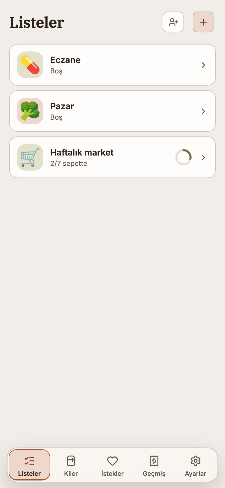
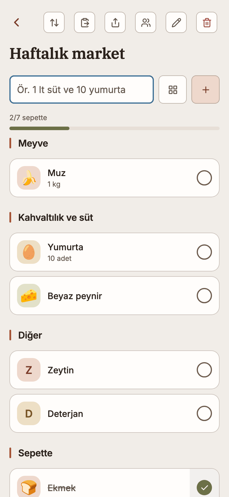
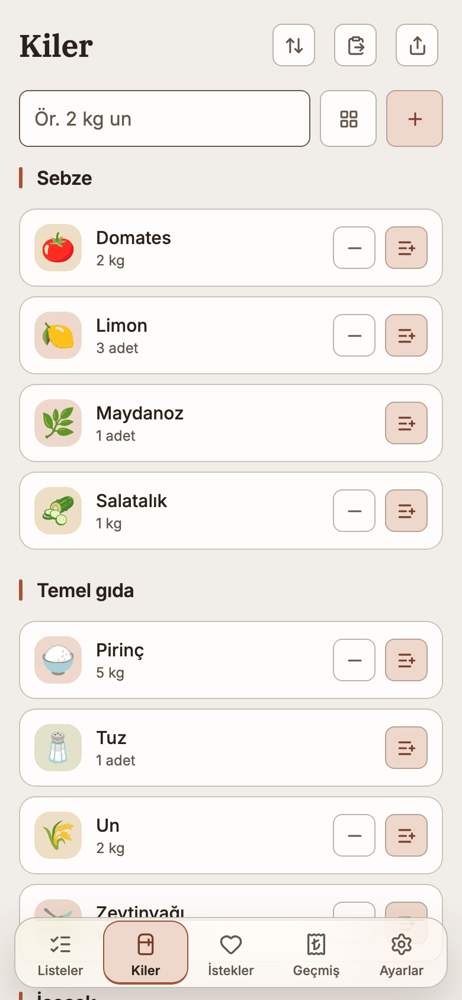
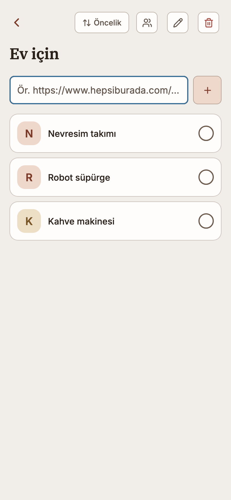
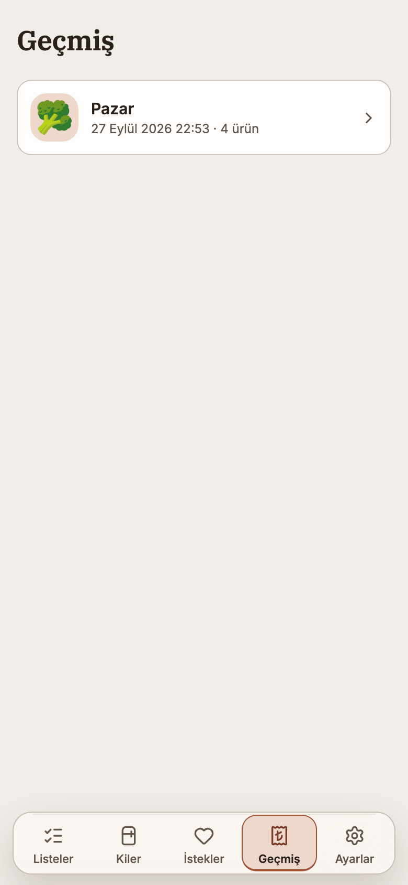
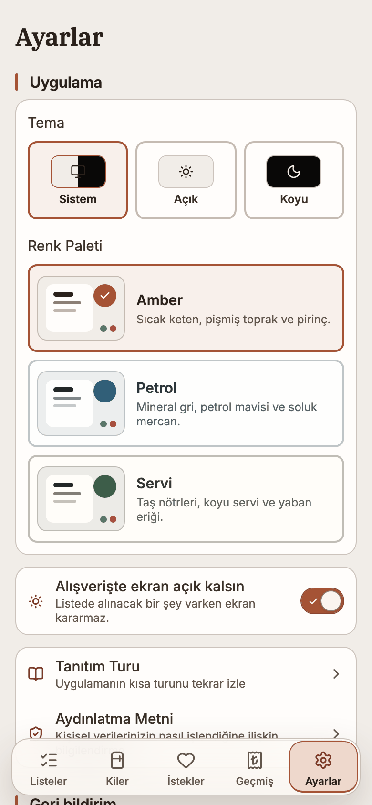
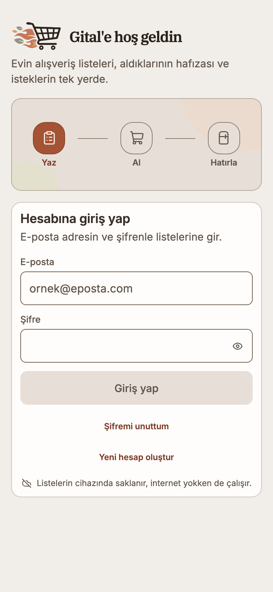

<div align="center">

<picture>
  <source media="(prefers-color-scheme: dark)" srcset="assets/brand/horizontal-dark.png">
  
</picture>

### Evin alışveriş listesi — birlikte, internetsiz de.

**Paylaşılan market listeleri, daha önce aldıklarının hafızası, kiler,**
**hazır setler ve linkten, fotoğraftan eklenen bir istek listesi.**

*A shared, offline-first shopping list for a household — lists two people tick
together in the aisle, a memory of what was bought before, a pantry, and a wish
list fed by links and photos. iOS, Android and the web from one codebase.*

<a href="https://topraksv.github.io/gital/"></a>

[](https://github.com/topraksv/gital/actions/workflows/ci.yml)
[](https://github.com/topraksv/gital/releases)
[](https://docs.expo.dev/versions/v57.0.0/)
[](#geliştirici-kurulumu)
[](LICENSE)

<br>

<p>
  <picture><source media="(prefers-color-scheme: dark)" srcset="assets/screenshots/m-lists-dark.png"></picture>
  <picture><source media="(prefers-color-scheme: dark)" srcset="assets/screenshots/m-list-dark.png"></picture>
  <picture><source media="(prefers-color-scheme: dark)" srcset="assets/screenshots/m-pantry-dark.png"></picture>
</p>

<sub>Ekran görüntüleri gerçek uygulamadan, tamamı örnek verilerle alındı. Sistem temanıza göre açık/koyu görünür.</sub>

</div>

---

## Gital ne yapar?

Market listesi bir kâğıtta ya da bir mesajda durur — ta ki evdeki iki kişi aynı
şeyi iki kez alana, "süt bitti mi?" sorusu rafın önünde sorulana ya da geçen ay
alınan deterjanın adı unutulana kadar. Gital listeyi evin ortak hafızasına
çevirir.

Üç cümlede:

- **Birlikte yazdırır.** Liste davet bağlantısıyla paylaşılır; biri eklediğinde
  öteki saniyeler içinde görür, kimin eklediği ve aldığı yazar.
- **Hatırlar.** Daha önce alınanlar, favoriler, hazır setler ve kiler; liste
  kendi geçmişinden biteni önerir ("Süt · 5 günde bir").
- **Rafın önünde beklemez.** Her şey önce cihazda; markette çekmeyen telefon
  da listeyi açar, işaretler, bitirir.

Gital bir hesapla kullanılır. Kayıtlar yine de **önce cihazda** durur;
bulut, cihazların ve evdekilerin arasını eşitlemek içindir, çalışmanın şartı
değil.

---

## İş başında

<table>
<tr>
<td align="center" width="33%"><picture><source media="(prefers-color-scheme: dark)" srcset="assets/screenshots/m-wishes-dark.png"></picture></td>
<td align="center" width="33%"><picture><source media="(prefers-color-scheme: dark)" srcset="assets/screenshots/m-history-dark.png"></picture></td>
<td align="center" width="33%"><picture><source media="(prefers-color-scheme: dark)" srcset="assets/screenshots/m-settings-dark.png"></picture></td>
</tr>
<tr>
<td align="center"><b>İstek listesi</b><br><sub>Bir ad ya da Trendyol, Hepsiburada, Amazon bağlantısı; telefonda adı, resmi ve fiyatı kendiliğinden gelir.</sub></td>
<td align="center"><b>Ne alındı, ne harcandı?</b><br><sub>Biten her alışveriş fişinin fotoğrafıyla durur; her ürün tek dokunuşla listesine döner.</sub></td>
<td align="center"><b>Senin düzenin</b><br><sub>Üç palet, iki tema, ekranın açık kalması, hatırlatıcılar ve son girişin hangi cihazdan olduğu.</sub></td>
</tr>
</table>

<details>
<summary><b>Giriş ekranı</b> — sepet uçar, alevleri oynar</summary>
<br>
<picture>
  <source media="(prefers-color-scheme: dark)" srcset="assets/screenshots/m-signin-dark.png">
  
</picture>
</details>

---

## Nereye bakacaksın?

| İhtiyacın | Gideceğin yer | Bulacakların |
|---|---|---|
| **Markete gidiyorum** | **Listeler** | Reyonlara ayrılmış liste; işaretlenen "Sepette"ye iner, "Alışverişi Bitir" geçmişe taşır |
| **Hızlı ekleme** | **Liste → alan** | "2 kg domates, 1,5 lt süt ve ekmek" üç ürün olur; yazarken geçmiş ve katalog önerilir |
| **Hazır bir set** | **Liste → katalog** | Reyon reyon katalog, yıldızlılar ve "Kahvaltı" gibi setler tek dokunuşla |
| **Evde ne var?** | **Kiler** | Adetler, son kullanma geri sayımı; biten ürün listesine döner |
| **Almak istediklerim** | **İstekler** | Koleksiyonlar, bağlantıyla ürün, öncelik ve fiyat sırası |
| **Geçen ay ne aldık?** | **Geçmiş** | Biten alışverişler, fişin fotoğrafı, altı aylık toplamlar, reyonların payı |
| **Evdekilerle paylaşmak** | **Liste → kişiler** | Davet bağlantısı: düzenleyebilir ya da yalnız görür |
| **Hesap** | **Ayarlar → Hesap güvenliği** | E-posta, şifre, veri sıfırlama, dondurma ve silme |

---

## Neden cihazda?

Her yazma önce cihazdaki SQLite veritabanına iner — veri satırı ve outbox kaydı
**tek transaction** içinde. Uygulama çevrimdışıyken eksiksiz çalışır; bağlantı
geldiğinde outbox Supabase'e gönderilir, paylaşılan listelerin değişiklikleri
canlı kanaldan gelir.

- **Silme geri alınabilir.** Silmeler tombstone'dur, cihazlar arasında tutarlı
  kalır; silinen liste altı saniye geri alınabilir.
- **Bozuk satır kuyruğu tıkamaz.** Reddedilen kayıt karantinaya alınır ve ne
  olduğu Ayarlar'da yazılır; ötekiler gitmeye devam eder.
- **Fotoğraf satırından önce gider.** Ürün, istek ve fiş fotoğrafı buluta
  yüklenmeden onu gösteren satır gönderilmez; kimse kırık resim görmez.

---

## Platformlar

| Platform | Nasıl açılır | Durum |
|---|---|---|
| **Web** | [topraksv.github.io/gital](https://topraksv.github.io/gital/) | `main`'e yapılan push web yüzeyine dokunduğunda otomatik yayımlanır; ana ekrana eklenip bağlantısız açılır |
| **iOS / Android** | Expo Go → EAS `preview` update'i | **Fiziksel cihaz kabulü henüz yapılmadı.** Tarayıcı testleri native SQLite, kamera, bildirim izni ve ekranın açık kalmasını kanıtlamaz |

Her sürümün ne getirdiği [Releases](https://github.com/topraksv/gital/releases)
sayfasında, tag'iyle birlikte duruyor; aynı notlar [CHANGELOG.md](CHANGELOG.md)
içinde.

Telefonlar uygulamayı Expo Go'da açar; development client yok ve mobil kullanım
Expo Go'nun SDK 57 ile sunduğu native kütüphanelerle sınırlı. TestFlight için
bir EAS Build profili (`eas.json` `production`) hazır, henüz hiç koşmadı.

---

## Tasarım

Gital, Helix'in tasarım dilini taşır ve ona biraz daha hareket ekler.

- **Palet:** Amber (pişmiş toprak), Petrol (mineral mavi), Servi (taş ve koyu
  yeşil). Ayarlar'dan anında değişir.
- **Hareket öğededir.** İşaretlenen ürün, biten alışverişin konfetisi, giriş
  ekranındaki sepetin alevleri; sayfa geçişi oynamaz. Hareket azaltma tercihi
  hepsini durdurur.
- **Tipografi:** içerik Inter, başlıklar IBM Plex Serif. Türkçe büyük harf
  `tr-TR` kurallarıyla.
- **Resim addan gelir.** Bir liste adına uyan çizimi kendisi seçer, bir ürün
  adına uyan simgeyi; ikisi de değiştirilebilir.
- **Erişilebilirlik ölçülür.** Metin kontrastı iki temada da hesaplanır; her
  dokunma hedefi en az 44 nokta.

---

## Gizlilik ve güvenlik

- **Önce cihaz:** her kayıt cihazdaki SQLite dosyasına yazılır; buluta giden o
  dosyanın eşitlenmiş kopyasıdır.
- **Yetki sunucudadır:** her tablo RLS ile korunur; bir listeyi yalnız sahibi
  ve davet ettikleri görür, istemci kontrolü yetki sayılmaz.
- **Anahtarlar:** istemci yalnız publishable anon anahtarı taşır.
- **Dış istekler:** barkod Open Food Facts'e sorulur; bir isteğin bağlantısını
  telefon görünmeden açar ve adını, resmini, fiyatını okur — mağaza olağan bir
  ziyaret görür. Kime ne gittiği uygulama içindeki Aydınlatma Metni'nde,
  alıcısıyla birlikte yazılı.
- **Giriş kaydı** cihazın adını tutar (iPhone · Safari), konumunu tutmaz.

---

## Geliştirici kurulumu

> **Node 22 zorunlu** (`.nvmrc`) — Expo SDK 57'nin derleyip test ettiği sürüm.

```bash
git clone https://github.com/topraksv/gital.git
cd gital
npm ci
cp .env.example .env             # boş bırakılırsa: yerel-yalnız geliştirme derlemesi

npm run web                      # tarayıcıda aç
npx expo start --tunnel --clear  # Expo Go
```

### Kalite kapısı

```bash
npm run verify        # typecheck + dosya başına kapsama eşikli Vitest + lint ratchet
npm run test:e2e      # Playwright: tarayıcı senaryoları
npm run verify:full   # + production export, bundle bütçesi, tüm Playwright
```

CI, bir push'un dokunduğu yolları okur ve testin ağırlığını ona göre seçer.
Mutasyon testi kodu kasıtlı olarak bozar ve testlerin bunu fark edip etmediğini
ölçer; `mutation-baseline.json` kapsamdaki her dosyanın (`src/domain`,
`src/data`, `src/db`, `src/sync`, `src/auth`, `src/services`) en son ne
kadarını yakaladığını tutar. `lint-baseline.json` her lint kuralının kaç kez
tetiklendiğini kaydeder ve daha sık tetiklenmesi push'u düşürür.

Bir sürüm tag'i ancak CI'ı yeşil bir commit'i gösterebilir; tag
`CHANGELOG.md`'deki bölümünü Releases sayfasına taşır.

### Kod haritası

| Kök dosya | Kim okur |
|---|---|
| `package.json`, `package-lock.json`, `.npmrc`, `.nvmrc` | npm ve Node sürüm kilidi |
| `app.json`, `eas.json`, `metro.config.js`, `babel.config.js` | Expo derleme zinciri |
| `tsconfig.json`, `eslint.config.js` | Tip ve biçim |
| `vitest.config.mts`, `vitest.mutation.config.mts`, `stryker.config.mjs`, `stryker.ci.config.mjs` | Test ve mutasyon koşuları |
| `playwright.config.ts` | Tarayıcı süiti |
| `lint-baseline.json`, `mutation-baseline.json` | Cırcır tabanları — lint sayısı düşebilir, yükselemez; mutasyon puanı yükselebilir, düşemez |
| `knip.json` | Ölü kod |
| `drizzle.config.ts` | SQLite şema üretimi |
| `README.md`, `CHANGELOG.md`, `LICENSE` | Depoyu açan insan |
| `.env.example`, `.gitignore`, `.mcp.json` | Yerel ortam değişkenleri, git, ajanların salt-okur Supabase MCP sunucuları |

| Klasör | Sorumluluk |
|---|---|
| `src/app/` | Expo Router rotaları ve ekran orkestrasyonu. Yaprak katman: kimse rotaları import etmez |
| `src/domain/` | Saf kurallar — ekleme ayrıştırma, miktar, fiyat, öneri, sıralama. React'sız, testlenebilir |
| `src/data/` | Kalıcılık cephesi ve canlı sorgu hook'ları |
| `src/db/` | Şema, migration'lar, atomik yazma katmanı |
| `src/sync/` | Outbox, birleştirme politikası, paylaşım, fotoğraflar, karantina |
| `src/auth/` | Oturum, hesap dondurma, giriş kaydı |
| `src/services/` | Yan etkili entegrasyonlar: barkod, pano, bildirim, paylaşım, geri bildirim |
| `src/ui/` | Tasarım sistemi ilkelleri ve tokenlar |
| `src/i18n/` | Arayüzdeki her metin |
| `supabase/` | Sunucu migration'ları, RLS testleri (pgTAP), geri bildirim fonksiyonu |
| `tests/<katman>/`, `e2e/` | Birim ve sözleşme testleri kaynağın katman adıyla; tarayıcı senaryoları |

Bağımlılık yönü `app → data → db` ve `app → domain`; `src/domain/` React, ağ ve
depolama içermez, bu yüzden kuralları tarayıcısız, veritabanısız test edilir.

---

## Lisans / License

**Proprietary — all rights reserved.** © 2026 Ömer Toprak Şavlı.

Kaynak; şeffaflık ve inceleme için görünürdür, açık kaynak değildir. Yazılı izin
olmadan çalıştırma, kopyalama, değiştirme, dağıtma veya ticari kullanım hakkı
vermez. Tam koşullar [LICENSE](LICENSE) içinde.
